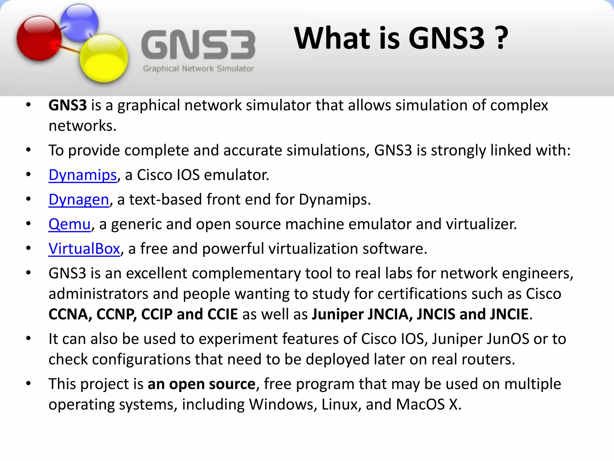

# What is GNS3?

GNS3, which stands for Graphical Network Simulator-3, is a widely used open-source software tool designed for network simulation and emulation. It allows users to create virtual networks on their computers by running real network operating systems, including Cisco IOS, Juniper Junos, and others, without the need for physical hardware.

GNS3 provides a graphical user interface that facilitates the design, configuration, and testing of complex network topologies. It is a valuable resource for network professionals, students, and enthusiasts, offering a platform to practice, experiment, and learn about networking in a safe and controlled virtual environment.

GNS3 supports a broad range of networking devices and technologies, making it a versatile tool for various educational and professional purposes, such as certification exam preparation, network design, and troubleshooting.

Here are some additional key features and aspects of GNS3:

1. **Device Support:** GNS3 supports a variety of networking devices, including routers, switches, and virtual machines, allowing users to simulate diverse network environments.

2. **Topology Design:** The software provides a graphical interface for designing network topologies, making it easy to create, modify, and visualize complex network setups.

3. **Virtualization:** GNS3 uses virtualization technologies to emulate network devices, allowing users to run actual operating systems and software images on their computers for a more realistic simulation.

4. **Community Support:** GNS3 has an active and supportive community that contributes to the project by sharing device templates, appliance images, and providing assistance through forums and online resources.

5. **Integration with Real Equipment:** While GNS3 primarily operates in a virtual environment, it can also integrate with physical hardware, allowing users to connect their GNS3 simulations to real network equipment for more comprehensive testing.

6. **Snapshot and Save State:** GNS3 allows users to save the state of their network simulations, creating snapshots that can be revisited later. This is particularly useful for troubleshooting or for returning to a specific point in a lab exercise.

7. **Packet Capturing and Analysis:** GNS3 supports the integration of Wireshark for packet capturing and analysis, helping users understand the details of network traffic in their simulations.

8. **Education and Training:** GNS3 is widely used in educational settings for teaching networking concepts and for hands-on training. It is commonly used by students preparing for various networking certifications, including those offered by Cisco.

9. **Open Source:** GNS3 is open-source software, which means that its source code is freely available for modification and improvement. This openness has contributed to its continuous development and improvement over time.

10. **Cross-Platform Compatibility:** GNS3 is compatible with multiple operating systems, including Windows, macOS, and various Linux distributions, making it accessible to a broad user base.

GNS3 serves as a versatile and powerful tool for network simulation and emulation, catering to both beginners learning about networking concepts and experienced professionals seeking to test and validate complex network scenarios.

https://www.gns3.com/
