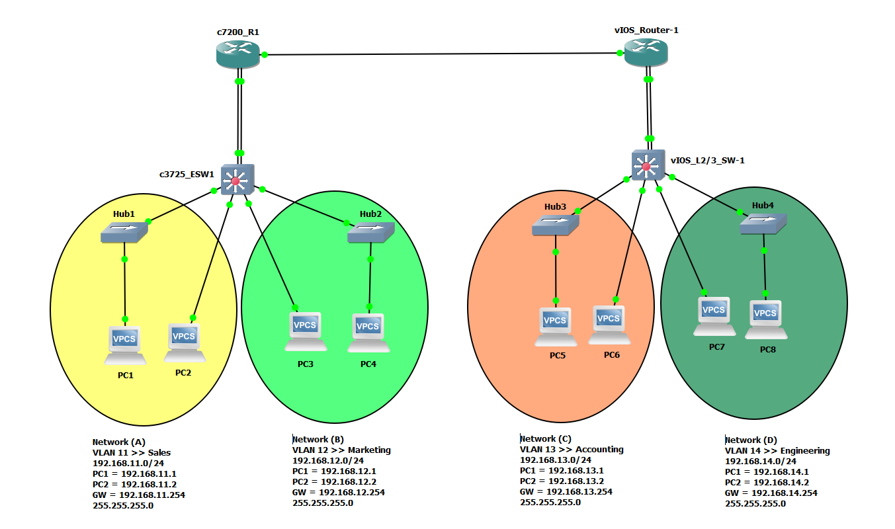

---

# Mastering Cisco CCT CCNA GNS3 Lab Cisco IOS VIRL EVE-NG Images Network Administration CCNA 200-301 Routing Switching P2

---

---

Default Username and Password >> `cisco/cisco`

---

Command >>

```bash
enable
```

---

Command >>

```bash
reload
```

---

Command >>

```bash
line console 0
login
password cisco
do write
```

---

Command >>

```bash
show mac address-table dynamic
```

---

Command >>

```bash
conf t
hostname switch
hostname router
do write
```

---

Command >>

```bash
conf t
interface fa0/0
speed 10
speed 100
speed 1000
speed auto
exit
```

---

Command >>

```bash
show running-config
show startup-config
```

---

Command >>

```bash
write erase
```

---

Command >>

```bash
erase startup-config
```

---

Command >>

```bash
erase nvram:
```

---

Command >>

```bash
undebug all
```

---

Command >>

```bash
copy running-config startup-config
write
```

---

Command >>

```bash
show interfaces
```

---

Command >>

```bash
show interfaces fa0/1 counters
```

---

Command >>

```bash
show mac address-table dynamic interface fa0/1
```

---

Command >>

```bash
show mac address-table dynamic vlan 1
```

---

Command >>

```bash
show mac address-table aging-time
```

---

Command >>

```bash
show mac address-table count
```

---

Command >>

```bash
enable secret cisco
```

---

Command >>

```bash
line vty 0 15
password cisco
login
end
```

---

Command >>

```bash
ip domain-name example.local
crypto key generate rsa
username cisco secret cisco
username admin secret admin
line vty 0 15
login local
exit
ip ssh version 2
exit
```

---

Command >>

```bash
line vty 0 15
transport input all
```

---

Command >>

```bash
line vty 0 15
transport input telnet ssh
```

---

Command >>

```bash
line vty 0 15
transport input ssh
```

---

Command >>

```bash
show ip ssh
show ssh
```

---

Command >>

```bash
interface vlan 1
no ip address
shutdown
exit
```

---

Command >>

```bash
interface vlan 11
ip address 192.168.11.254 255.255.255.0
no shutdown
exit
vlan 11
name Sales
exit
interface vlan 12
ip address 192.168.12.254 255.255.255.0
no shutdown
exit
vlan 12
name Marketing
exit
interface vlan 13
ip address 192.168.13.254 255.255.255.0
no shutdown
exit
vlan 13
name Accounting
exit
interface vlan 14
ip address 192.168.14.254 255.255.255.0
no shutdown
exit
vlan 14
name Engineering
exit

```

---

Command >>

```bash
show ip int bri
```

---

Command >>

```bash
show vlan
```

---

Command >>

```bash
show int vlan 11
show int vlan 13
```

---

Command >>

```bash
show arp
```

---

Command >>

```bash
show cdp nei
```

---

Command >>

```bash
show int status
```

---

Command >>

```bash
int fa0/4
switchport
sw access vlan 11
sw mode access
```

---

Command >>

```bash
int fa0/5
switchport
sw access vlan 13
sw mode access
```

---

Command >>

```bash
show cdp neighbors detail
```

---

Command >>

```bash
int fa0/1
switchport
sw access vlan 11
sw mode access
```

---

Command >>

```bash
int fa0/2
switchport
sw access vlan 13
sw mode access
```

---

Command >>

```bash
int fa0/3
switchport
sw access vlan 13
sw mode access
```

---

Command >>

```bash
ip default-gateway 192.168.11.254
```

---

Command >>

```bash
show run
write
show startup
```

---

Command >>

```bash
show ip route
```

---

Command >>

```bash
show history
```

---

Command >>

```bash
interface fa0/0
speed auto
dupelx half
duplex full
duplex auto
exit
```

---

Command >>

```bash
interface fa0/0 - 1
no shut
```

---

Command >>

```bash
show int fa0/0
```

---

Command >>

```bash
int fa0/0
no speed
no duplex
description UPLINK/ACCESS
no description
```

---

Command >>

```bash
show int status
show int fa0/1 status
```

---

Command >>

```bash
ping 192.168.11.254
ping 192.168.11.251
ping 192.168.13.254
```

---

Command >>

```bash
show arp
```

---

Command >>

```bash
conf t
cdp run
int fa0/0
cdp enable
```

---

Command >>

```bash
conf t
no cdp run
int fa0/0
no cdp enable
```

---

Command >>

```bash
traceroute 192.168.11.1
traceroute 192.168.11.254
traceroute 192.168.13.1
traceroute 192.168.13.254
```

---

Command >>

```bash
show run | sec line
show int desc
show ver
dir
conf t
cdp run
cdp advertise-v2
cdp timer 5
do show cdp neighbors detail
exit
show int stats
conf t
ip routing
do show ip route
int fa1/0
no switchport
ip addr 10.1.1.1 255.255.255.0
no shutdown
do show ip int bri
do show ip route
ssh -l cisco 10.1.1.1
show ssh
show users
```

---

PC Command >>

```bash
help
arp
show
save
ping 192.168.11.254
ping 192.168.13.254
trace 192.168.11.1
trace 192.168.13.1
```
