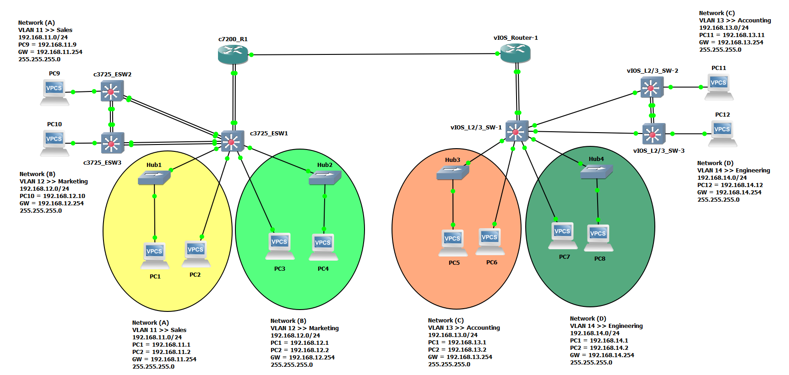
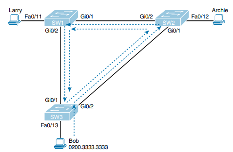
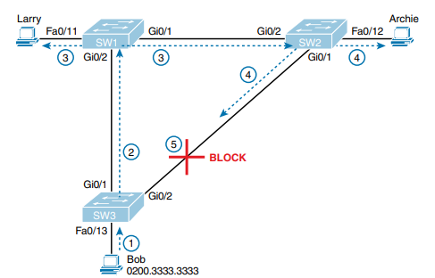
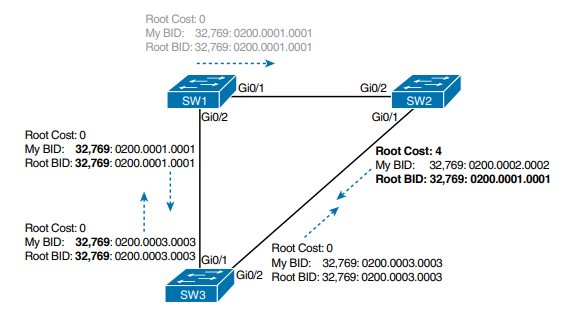
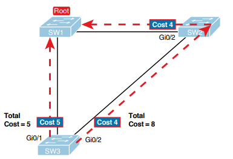
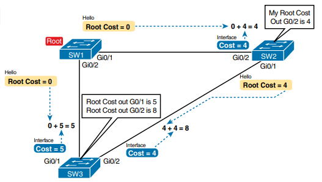
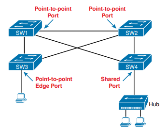

---

# Mastering Cisco CCT CCNA GNS3 Lab Cisco IOS VIRL EVE-NG Images Network Administration CCNA 200-301 Routing Switching P3 STP RSTP

---

Default Username and Password >> `cisco/cisco`

---

Spanning Tree Protocol (STP) is a network protocol used to prevent loops in bridged or switched networks. Loops can occur when there are redundant paths between network devices, and if not properly managed, they can cause network congestion and even network outages.

STP works by allowing network switches to exchange information about their connections and then collectively decide which paths should be active and which should be blocked to ensure there is only one active path between any two network devices. This active path forms a loop-free topology.

Here are some key points about STP and its importance:

1. **Loop Prevention**: The primary function of STP is to prevent loops in the network. Loops occur when there are multiple paths between switches, and packets end up being forwarded endlessly between them. STP ensures that only one active path exists between any two network devices, effectively eliminating loops.

2. **Redundancy**: While loops are undesirable, having redundant links in a network can be beneficial for fault tolerance and load balancing. STP allows for the creation of a loop-free topology while still utilizing redundant links. If the active path fails, STP reconverges to use an alternate path, ensuring network reliability.

3. **Automatic Configuration**: STP operates autonomously once configured. It dynamically determines the best paths and adjusts the network topology in response to changes such as link failures or additions, without requiring manual intervention.

4. **Compatibility**: STP is a widely adopted standard and is supported by most network switches and routers. This makes it a versatile solution for ensuring loop-free operation in Ethernet networks.

5. **Variants and Enhancements**: Over time, various enhancements and extensions to STP have been developed to improve its efficiency and convergence time. These include Rapid Spanning Tree Protocol (RSTP) and Multiple Spanning Tree Protocol (MSTP), which offer faster convergence and better support for VLANs, respectively.

STP is crucial for maintaining a stable and efficient network infrastructure by preventing loops and ensuring reliable communication between network devices. Its automatic operation and widespread support make it an essential protocol in modern Ethernet networks.

---

Spanning Tree Protocol (STP) and Rapid Spanning Tree Protocol (RSTP) are both network protocols designed to prevent loops in bridged or switched networks, but they differ in their operation and features. Here's a comparison between the two:

1. **Convergence Time**:

   - STP: Traditional STP typically has a convergence time of around 30 to 50 seconds. This is because it goes through multiple stages (blocking, listening, learning, and forwarding) before determining the optimal topology.
   - RSTP: RSTP significantly improves convergence time compared to STP. It typically converges in just a few seconds (usually less than 5 seconds) by using techniques like port roles (e.g., discarding, learning, forwarding) and link types (e.g., point-to-point, edge).

2. **Topology Changes**:

   - STP: In STP, topology changes are detected by exchanging Bridge Protocol Data Units (BPDUs) between switches. Upon detecting a change, STP goes through the entire convergence process, leading to longer reconvergence times.
   - RSTP: RSTP reduces the impact of topology changes by immediately transitioning ports to the forwarding state when a topology change occurs. This rapid transition helps to minimize the disruption caused by network changes.

3. **Port States**:

   - STP: STP has five port states: blocking, listening, learning, forwarding, and disabled. Ports go through these states sequentially during the convergence process.
   - RSTP: RSTP simplifies the port states to three: discarding (similar to blocking in STP), learning, and forwarding. This simplification helps in faster convergence by reducing the number of states a port goes through.

4. **Backward Compatibility**:

   - STP: Traditional STP is backward compatible with older switches that only support STP. However, it does not take advantage of the rapid convergence features of RSTP.
   - RSTP: RSTP is backward compatible with STP, allowing RSTP-enabled switches to interoperate with legacy STP switches. RSTP switches can also operate in a compatibility mode where they function as STP switches when communicating with legacy devices.

5. **Protocol Overhead**:
   - STP: Traditional STP has relatively high protocol overhead due to the periodic exchange of BPDUs and the longer convergence time.
   - RSTP: RSTP reduces protocol overhead by minimizing the frequency of BPDU exchanges and by quickly converging to the optimal topology.

RSTP offers significant improvements over traditional STP in terms of convergence time, handling topology changes, and reducing protocol overhead. Its rapid convergence makes it more suitable for modern networks where fast reconvergence is essential for maintaining network stability and minimizing downtime.

---



A broadcast storm is a phenomenon that occurs in a computer network when a large volume of broadcast or multicast messages is generated by one or more network devices, leading to a significant increase in network traffic and potentially causing network congestion or even network failure. Here are some advantages, disadvantages, and the relationship between broadcast storms and STP:

Advantages:

1. **Redundancy Testing**: Broadcast storms can inadvertently reveal weaknesses or inefficiencies in network redundancy configurations. By flooding the network with broadcasts, potential issues with redundant paths and loops can be uncovered, allowing network administrators to address them proactively.

2. **Network Troubleshooting**: In some cases, broadcast storms can help pinpoint faulty network equipment or misconfigurations. When a broadcast storm occurs, it can quickly draw attention to the affected network segment, aiding in the troubleshooting process.

Disadvantages:

1. **Network Congestion**: One of the most significant drawbacks of broadcast storms is the resulting network congestion. The excessive volume of broadcast traffic can saturate network links and overwhelm network devices, leading to degraded performance or complete network outage.

2. **Packet Loss and Latency**: As network devices become inundated with broadcast traffic, they may struggle to process legitimate data packets, resulting in increased packet loss and latency for normal network traffic.

3. **Service Disruption**: In extreme cases, a severe broadcast storm can bring down an entire network, causing widespread service disruption and downtime for users and applications.

Relation to STP:

Spanning Tree Protocol (STP) plays a crucial role in mitigating the risks associated with broadcast storms. By actively monitoring the network topology and selectively blocking redundant paths, STP helps prevent the formation of network loops, which are often a precursor to broadcast storms.

Here's how STP helps address broadcast storms:

1. **Loop Prevention**: STP ensures that redundant paths in the network are identified and blocked to prevent the formation of loops. By maintaining a loop-free topology, STP reduces the likelihood of broadcast storms occurring due to looping broadcast traffic.

2. **Topology Changes**: In the event of a network topology change, such as a link failure or addition, STP rapidly reconverges to adapt to the new topology and prevent the propagation of broadcast storms. This rapid reconvergence helps minimize the duration and impact of potential broadcast storms on the network.

While broadcast storms can pose significant challenges to network stability and performance, STP serves as a critical mechanism for mitigating the risks associated with these disruptive events and maintaining a resilient and efficient network infrastructure.

---

When redundant LANs (Local Area Networks) are deployed without using Spanning Tree Protocol (STP) or a similar loop prevention mechanism, several classes of problems can arise, which can severely impact network performance, stability, and reliability. Here are three main classes of problems caused by not using STP in redundant LANs:

1. **Broadcast Storms**:

   - **Description**: A broadcast storm occurs when broadcast or multicast packets flood the network, often due to network loops. Without STP to prevent loops, broadcast packets can endlessly circulate between network devices, exponentially increasing traffic volume and consuming network resources.
   - **Impact**: Broadcast storms lead to network congestion, packet collisions, increased latency, and degraded performance for all network traffic. They can ultimately result in network downtime or severe service disruptions.
   - **Example**: In a redundant LAN configuration without STP, if a broadcast packet is sent out from a device and encounters multiple redundant paths, it can loop back to the originating device, initiating a broadcast storm.

2. **MAC Address Table Instability**:

   - **Description**: In a redundant LAN environment without STP, network switches may encounter inconsistent or conflicting MAC address tables due to the presence of network loops. Switches learn MAC addresses associated with specific ports, but in the presence of loops, they may receive MAC addresses from multiple ports simultaneously, leading to ambiguity and instability.
   - **Impact**: MAC address table instability can cause packet forwarding errors, resulting in misdirected traffic, packet drops, or even network loops. This instability can disrupt normal network operations and compromise network performance.
   - **Example**: Without STP, if a switch receives frames with the same source MAC address from multiple ports simultaneously due to a loop, it may have difficulty determining the correct egress port for forwarding subsequent frames to that MAC address.

3. **Switching Loops and Packet Duplication**:
   - **Description**: In the absence of STP, redundant LAN configurations can create switching loops where packets circulate endlessly between switches. These loops cause packets to be duplicated and forwarded repeatedly, leading to inefficient use of network bandwidth and resources.
   - **Impact**: Switching loops result in increased network traffic, congestion, and degradation of network performance. Duplicate packets consume network bandwidth and can overwhelm network devices, potentially causing network instability or failure.
   - **Example**: If two switches are interconnected via multiple redundant links without STP, a packet sent from one switch may traverse both links repeatedly, resulting in packet duplication and wasting network resources.

Not using STP in redundant LANs can lead to various problems such as broadcast storms, MAC address table instability, and switching loops, all of which can degrade network performance, stability, and reliability. Implementing STP or a similar loop prevention mechanism is essential for maintaining a robust and efficient network infrastructure.

---



Spanning Tree Protocol (STP) and Rapid Spanning Tree Protocol (RSTP) are network protocols designed to prevent loops in bridged or switched networks. One of the fundamental actions performed by STP/RSTP to prevent loops is to block specific ports in the network topology. This action helps break potential loops and ensures the creation of a loop-free network topology. Here's how STP/RSTP accomplishes this:

1. **Loop Detection and Prevention**:

   - When switches are interconnected to form a network, there is a possibility of creating loops, especially in redundant network designs where multiple paths exist between switches.
   - STP/RSTP algorithms run on the switches to detect and mitigate these loops. They achieve this by collectively electing a root bridge (the switch serving as the root of the spanning tree) and selectively blocking ports to prevent loops.

2. **Root Bridge Election**:

   - The first step in loop prevention is to elect a root bridge. Each switch in the network compares the Bridge ID (BID), which consists of a priority value and a MAC address, of all the switches it knows about. The switch with the lowest BID becomes the root bridge.
   - All ports on the root bridge remain in the forwarding state because it serves as the reference point for the spanning tree topology.

3. **Designated and Non-Designated Ports**:

   - After electing the root bridge, each non-root switch selects one of its ports as the root port (the port through which it has the shortest path to the root bridge).
   - The remaining ports on each switch are designated ports, which are responsible for forwarding traffic toward the root bridge.
   - Any ports that are not root ports or designated ports are considered non-designated ports.

4. **Blocking Ports**:

   - STP/RSTP determines additional ports that need to be blocked to eliminate loops in the network topology. These ports are typically those that would create a loop if left in the forwarding state.
   - Blocking a port effectively disables it from forwarding traffic, ensuring that loops cannot form.
   - The blocked ports remain in a state known as the "blocking" or "discarding" state. While in this state, they still listen to BPDUs (Bridge Protocol Data Units) to monitor the network topology and quickly transition to forwarding if necessary due to a topology change.

5. **Adapting to Topology Changes**:
   - STP/RSTP continuously monitors the network topology for changes, such as link failures or additions. When a change occurs, the protocol quickly recalculates the spanning tree and adjusts port states accordingly to maintain a loop-free topology.

STP/RSTP blocks specific ports in the network to break potential loops and ensure the creation of a loop-free spanning tree topology. By selectively blocking ports and continuously adapting to changes in the network, STP/RSTP helps maintain network stability and prevent the adverse effects of loops, such as broadcast storms and network congestion.

---

Spanning Tree Protocol (STP) is a network protocol used to prevent loops in bridged or switched Ethernet networks. Here's how STP works and the port states associated with it:

1. **Root Bridge Election**:

   - Every switch participating in STP elections initially thinks itself as the root bridge. The process of root bridge election involves comparing Bridge IDs (BIDs), which consist of a priority value and a MAC address. The switch with the lowest BID becomes the root bridge.
   - All other switches in the network then determine their shortest path to the root bridge.

2. **Port States**:

   - **Root Bridge Ports**:

     - Root ports are the ports on non-root bridges that have the shortest path to the root bridge. These ports are in the forwarding state, allowing traffic to flow towards the root bridge.
     - The root bridge itself has all of its ports in the forwarding state because it serves as the reference point for the spanning tree topology.

   - **Non-Root Bridge Ports**:

     - Non-root bridges have ports that are either designated ports or blocked ports.
     - Designated ports are ports on non-root bridges that have the lowest path cost to the root bridge for a particular segment. They are in the forwarding state, forwarding traffic towards the root bridge.
     - Blocked ports are ports that are not designated ports or root ports. These ports are put into a blocking state, effectively blocking any traffic from being forwarded through them. This prevents loops in the network topology.

   - **Ports Connected to End Devices**:
     - Ports connected to end devices (e.g., computers, servers) are typically designated ports because they provide the shortest path to the root bridge for those devices. These ports are in the forwarding state, allowing end device traffic to reach the rest of the network.

3. **Transitioning Between Port States**:
   - Port states transition based on the receipt of Bridge Protocol Data Units (BPDUs) and changes in the network topology.
   - Initially, ports go through the blocking state, then move to the listening state, followed by the learning state, and finally reach the forwarding state.
   - When topology changes occur (e.g., link failure, link recovery), STP reconverges, recalculates the spanning tree, and adjusts port states accordingly to maintain a loop-free topology.

STP works by electing a root bridge and selecting ports on switches to be in forwarding or blocking states based on their role in the spanning tree topology. This process ensures that a loop-free topology is maintained, preventing broadcast storms and other adverse effects of network loops.

---

BPDU stands for Bridge Protocol Data Unit. It is a type of frame used by Spanning Tree Protocol (STP) and its variants (such as Rapid Spanning Tree Protocol, RSTP) for communication between network switches to exchange information about the spanning tree topology. BPDUs contain various parameters and configuration details that switches use to participate in the spanning tree algorithm and maintain a loop-free network topology.

Here's some information about BPDUs and the timers associated with them:

1. **Content of BPDUs**:

   - BID (Bridge ID): This uniquely identifies the switch sending the BPDU and consists of a priority value and the MAC address of the switch.
   - Root Bridge ID: Identifies the root bridge of the spanning tree.
   - Path Cost: Represents the cumulative cost from the sending switch to the root bridge.
   - Port ID: Identifies the port through which the BPDU is being sent.
   - Port Role: Indicates the role of the port in the spanning tree topology (root port, designated port, or blocked port).
   - Message Age: Indicates how long the BPDU has been circulating in the network.
   - Hello Time: Specifies the interval at which BPDUs are sent.
   - Forward Delay: Specifies the time a port remains in the listening and learning states before transitioning to the forwarding state.
   - Max Age: Specifies the maximum time a switch will wait without receiving a BPDU before considering the root bridge lost.

2. **Timers Associated with BPDUs**:
   - **Hello Time**: This timer determines the interval between the transmission of BPDUs by a switch. It is typically 2 seconds for STP and 1 second for RSTP. Shorter hello times allow for faster detection of network topology changes.
   - **Forward Delay**: This timer defines the time a port spends in the listening and learning states before transitioning to the forwarding state. It is typically 15 seconds for STP and 4 seconds for RSTP. Shorter forward delay times reduce the convergence time of the spanning tree.
   - **Max Age**: This timer specifies the maximum age allowed for a BPDU before it is considered stale. It is typically 20 seconds for STP and 6 seconds for RSTP. If a switch does not receive BPDUs within the max age, it assumes that the root bridge has failed, and it initiates a topology change.

BPDUs are crucial for switches to exchange information and participate in the spanning tree algorithm effectively. They allow switches to determine the root bridge, calculate the shortest path to the root, and select ports for forwarding or blocking to ensure a loop-free topology.

---



Here are some important notes about the root bridge election process in Spanning Tree Protocol (STP):

1. **Priority and MAC Address**: The root bridge is elected based on a combination of the bridge priority and the MAC address. The bridge priority is a configurable value (ranging from 0 to 65,535) assigned to each switch. By default, all switches have a priority of 32,768. If the priorities are equal, the switch with the lowest MAC address becomes the root bridge.

2. **Lowest Bridge ID**: The combination of bridge priority and MAC address forms the Bridge ID (BID). The switch with the lowest BID becomes the root bridge. The root bridge is the central point of the spanning tree and serves as the reference point for all other switches in the network.

3. **Priority Preemption**: Bridge priority can be manually configured to influence the root bridge election process. Lowering the priority of a switch increases its chances of becoming the root bridge. Priority preemption allows for administrative control over the root bridge selection process.

4. **Topology Stability**: The root bridge election process is critical for the stability and efficiency of the spanning tree topology. A stable root bridge ensures consistent path selection and optimal traffic flow throughout the network.

5. **Convergence Time**: The root bridge election process occurs initially when switches are powered on or connected to the network. Subsequent changes in the network topology, such as link failures or additions, trigger a rapid reconvergence process to re-elect the root bridge and update the spanning tree accordingly.

6. **Network Stability**: The root bridge is responsible for determining the shortest path to all other switches in the network. By minimizing the path cost to the root bridge, STP ensures a loop-free topology, preventing broadcast storms and other network issues caused by loops.

7. **Bridge ID Propagation**: During the root bridge election process, switches exchange Bridge Protocol Data Units (BPDUs) containing their BIDs. These BPDUs propagate throughout the network, allowing switches to compare BIDs and determine the root bridge.

Understanding the root bridge election process is essential for network administrators to design and maintain stable and efficient spanning tree topologies. It ensures proper traffic distribution and fault tolerance in Ethernet networks.

---



Root ports are crucial components in Spanning Tree Protocol (STP) that determine the shortest path from a non-root bridge to the root bridge within a network topology. Understanding root ports and their associated root paths is essential for optimizing network performance and ensuring a loop-free spanning tree topology. Here are some important points about root ports and root paths:

1. **Root Port Selection**:

   - Each non-root bridge in the network selects one of its ports as the root port. The root port is the port that offers the shortest path to the root bridge in terms of cumulative path cost.
   - Path cost is calculated based on the sum of the costs associated with traversing each link between the non-root bridge and the root bridge. Lower path costs represent shorter and more efficient paths.

2. **Optimal Path to Root Bridge**:

   - The root port is crucial for ensuring that traffic from the non-root bridge reaches the root bridge along the most direct and efficient path. By selecting the root port, switches can minimize latency, reduce network congestion, and optimize traffic flow throughout the network.

3. **Path Cost Calculation**:

   - Path cost is determined by the speed of the links between switches. Faster links have lower costs, while slower links have higher costs. For example, a Gigabit Ethernet link typically has a lower path cost than a Fast Ethernet link.
   - The STP algorithm uses path cost to compare alternative paths to the root bridge and selects the path with the lowest cumulative cost as the root port.

4. **Adapting to Topology Changes**:

   - If the network topology changes, such as a link failure or addition, switches may need to reevaluate their root port selection. The STP algorithm reconverges to recalibrate the spanning tree topology and adjust root port assignments as necessary to maintain optimal connectivity.

5. **Loop Prevention**:
   - Root ports play a crucial role in preventing loops in the network topology. By ensuring that each non-root bridge has a designated path to the root bridge, STP constructs a loop-free spanning tree, eliminating the risk of broadcast storms and other network disruptions caused by loops.

Root ports and their associated root paths are essential for establishing optimal connectivity and maintaining a loop-free spanning tree topology in Ethernet networks. By selecting the shortest path to the root bridge, root ports help minimize latency, optimize traffic flow, and ensure network stability and reliability.

---



Spanning Tree Protocol (STP) uses a cost metric to determine the most efficient path from each switch to the root bridge within a network topology. The cost of a path is calculated based on the speed of the links (interfaces) between switches. Here's how STP costs are calculated and some important points about interface costs:

1. **Link Speed and Cost**:

   - The cost of a path is inversely proportional to the speed of the link. Faster links have lower costs, while slower links have higher costs.
   - The cost of a path is calculated as a function of the link speed, typically measured in Mbps (megabits per second). The formula for calculating the cost is: \( \text{Cost} = 10^{8} \div \text{Link Speed in Mbps} \).
   - For example, a Fast Ethernet link (100 Mbps) has a cost of \( 10^{8} \div 100 = 1000 \), while a Gigabit Ethernet link (1000 Mbps) has a cost of \( 10^{8} \div 1000 = 100 \).

2. **Standard Interface Costs**:

   - STP defines standard interface costs for different link speeds to ensure interoperability and consistency across network devices.
   - The IEEE 802.1D standard specifies the following interface costs:
     - 10 Mbps (Ethernet): Cost = 10,000
     - 100 Mbps (Fast Ethernet): Cost = 1,000
     - 1 Gbps (Gigabit Ethernet): Cost = 100
     - 10 Gbps (10 Gigabit Ethernet): Cost = 10
     - 40 Gbps (40 Gigabit Ethernet): Cost = 4
     - 100 Gbps (100 Gigabit Ethernet): Cost = 2
     - 1 Tbps (1 Terabit Ethernet): Cost = 1

3. **Custom Interface Costs**:

   - Network administrators have the flexibility to manually adjust interface costs to prioritize certain paths or accommodate specific network requirements.
   - By modifying interface costs, administrators can influence the spanning tree topology and control the path selection process.

4. **Path Cost Calculation**:
   - The path cost is the sum of the costs associated with traversing each link along the path from a switch to the root bridge.
   - When multiple paths exist between switches, STP selects the path with the lowest cumulative cost as the preferred path to the root bridge.
   - The goal is to establish a loop-free topology while optimizing network performance and resource utilization.

Understanding STP costs and interface costs is essential for network administrators to design and maintain efficient spanning tree topologies. By carefully managing interface costs, administrators can control path selection and ensure optimal connectivity within the network.

---

Spanning Tree Protocol (STP) and Rapid Spanning Tree Protocol (RSTP) use timers to control various aspects of the spanning tree operation, including convergence time and port roles. Here's an overview of STP timers, convergence time, and a comparison of RSTP port roles with STP:

1. **STP Timers**:

   a. **Hello Time**: Determines the interval at which BPDUs (Bridge Protocol Data Units) are sent between switches. The default hello time for STP is 2 seconds. BPDUs are used for neighbor discovery and to maintain connectivity within the spanning tree.

   b. **Forward Delay**: Specifies the time a port remains in the listening and learning states before transitioning to the forwarding state. The default forward delay for STP is 15 seconds. During this time, the switch learns MAC addresses and populates its forwarding table.

   c. **Max Age**: Specifies the maximum time a switch will wait without receiving a BPDU before considering the root bridge lost. The default max age for STP is 20 seconds. If a switch does not receive BPDUs within the max age, it assumes that the root bridge has failed and initiates a topology change.

2. **Convergence Time**:

   - Convergence time refers to the time it takes for the spanning tree topology to stabilize after a topology change, such as a link failure or recovery.

   - STP convergence time is relatively slow, typically taking 30 to 50 seconds to reconverge after a topology change. This slow convergence time is due to the sequential nature of the STP algorithm, which involves multiple phases (blocking, listening, learning, and forwarding) before reaching a stable topology.

   - RSTP significantly improves convergence time compared to STP. RSTP typically converges in just a few seconds (usually less than 5 seconds) by using techniques like port roles and link types to quickly adapt to topology changes.

3. **Comparison of RSTP Port Roles with STP**:

   a. **Root Port**:

   - In STP, the root port is the port on a non-root bridge that offers the shortest path to the root bridge.
   - In RSTP, the root port serves the same function but with faster convergence due to the simplified port roles and faster transition times.

   b. **Designated Port**:

   - Designated ports are ports on switches that have been selected as the designated forwarder for a particular segment.
   - Both STP and RSTP use designated ports to forward traffic towards the root bridge. RSTP typically converges faster due to its rapid transition times.

   c. **Blocked Port**:

   - Blocked ports are ports that are not root ports or designated ports. They are put into a blocking state to prevent loops in the network topology.
   - RSTP uses a similar concept of blocked ports for loop prevention, but it converges faster than STP due to its improved port roles and faster transition times.

RSTP improves upon STP by reducing convergence time through faster transition times and simplified port roles. This improvement enhances network efficiency and responsiveness to topology changes, making RSTP a preferred choice for modern Ethernet networks.

---



Rapid Spanning Tree Protocol (RSTP) introduces the concept of link types or port types to facilitate faster convergence and better support for modern network environments. RSTP defines three main port types, each with its specific behavior and role in the spanning tree topology:

1. **Root Port (RP)**:

   - The Root Port is the port on a non-root bridge that provides the shortest path to the root bridge. It is responsible for forwarding traffic towards the root bridge.
   - RSTP rapidly selects the Root Port based on path costs, allowing for faster convergence compared to STP.

2. **Designated Port (DP)**:

   - Designated Ports are selected on each network segment to forward traffic towards the root bridge. They are responsible for aggregating traffic from multiple switches and ensuring efficient communication within the spanning tree topology.
   - RSTP ensures rapid selection of Designated Ports, reducing convergence time and optimizing network performance.

3. **Alternate Port (AP)**:

   - Alternate Ports serve as backup paths to the Root Port on a non-root bridge. They are placed in a discarding state but are ready to transition to the forwarding state if the Root Port fails.
   - RSTP ensures that Alternate Ports are quickly activated in case of a Root Port failure, providing fast convergence and fault tolerance.

4. **Backup Port (BP)**:

   - Backup Ports are similar to Alternate Ports and serve as backup paths to Designated Ports on a network segment. They are placed in a discarding state but can quickly transition to the forwarding state if the Designated Port fails.
   - RSTP ensures rapid activation of Backup Ports to maintain network connectivity and minimize downtime in the event of a Designated Port failure.

5. **Edge Port (EP)**:
   - Edge Ports are ports that connect to end devices, such as computers or servers, rather than to other switches. They are configured as point-to-point links and do not participate in the spanning tree topology.
   - RSTP rapidly identifies Edge Ports and places them in the forwarding state immediately, bypassing the listening and learning states. This feature reduces latency for end devices and enhances network performance.

By introducing these port types, RSTP improves upon the original STP by providing faster convergence, better support for redundant links, and optimized performance for modern network environments. These port types play a crucial role in maintaining a stable and efficient spanning tree topology while minimizing network downtime and disruptions.

---

Configuring Spanning Tree Protocol (STP) on Cisco switches involves using a variety of commands within the Cisco IOS command-line interface (CLI). Here are some common STP-related commands used on Cisco switches:

1. **Enabling STP**:

   ```
   switch(config)# spanning-tree mode {stp | rapid-pvst | mst}
   ```

   - This command enables STP and specifies the mode of operation. Options include:
     - stp: Standard STP (IEEE 802.1D)
     - rapid-pvst: Rapid PVST+ (Per-VLAN Spanning Tree Plus)
     - mst: Multiple Spanning Tree (IEEE 802.1s)

2. **Setting Bridge Priority**:

   ```
   switch(config)# spanning-tree vlan vlan-id priority priority-value
   ```

   - This command sets the bridge priority for a specific VLAN. Lower priority values increase the likelihood of the switch becoming the root bridge.

3. **Viewing STP Configuration**:

   ```
   switch# show spanning-tree [vlan vlan-id]
   ```

   - This command displays the current STP configuration, including root bridge information, port roles, port states, and timers.

4. **PortFast Configuration**:

   ```
   switch(config-if)# spanning-tree portfast
   ```

   - This command enables PortFast on an interface, which transitions the interface directly to the forwarding state to bypass the listening and learning states. It's commonly used on access ports connected to end devices to minimize downtime during link initialization.

5. **BPDU Guard Configuration**:

   ```
   switch(config-if)# spanning-tree bpduguard enable
   ```

   - This command enables BPDU Guard on an interface, which shuts down the interface if it receives any BPDUs. It's used to prevent loops caused by unauthorized devices being connected to the network.

6. **BPDU Filtering Configuration**:

   ```
   switch(config-if)# spanning-tree bpdufilter enable
   ```

   - This command enables BPDU Filtering on an interface, which prevents the transmission and reception of BPDUs on that interface. It's used to disable STP operation on ports where STP isn't necessary or supported.

7. **Root Guard Configuration**:
   ```
   switch(config-if)# spanning-tree guard root
   ```
   - This command enables Root Guard on an interface, which prevents the interface from becoming a root port. It's used to protect the network from unauthorized switches attempting to become the root bridge.

These commands provide a basic overview of STP configuration on Cisco switches. Depending on the specific requirements and network topology, additional commands and configurations may be necessary. Always refer to Cisco documentation and best practices when configuring STP on Cisco switches.

---

Here are some additional STP-related commands used on Cisco switches:

8. **Bridge Assurance Configuration**:

   ```
   switch(config)# spanning-tree portfast bpduguard default
   ```

   - This command globally enables PortFast and BPDU Guard on all PortFast-enabled interfaces. Bridge Assurance ensures that PortFast interfaces do not cause STP loops by verifying connectivity with the directly connected switch.

9. **Root Bridge Selection**:

   ```
   switch(config)# spanning-tree vlan vlan-id root primary
   ```

   - This command instructs the switch to actively attempt to become the root bridge for the specified VLAN. It sets the switch's priority to the lowest value (i.e., 0) to prioritize root bridge election.

10. **Bridge Priority Adjustment**:

    ```
    switch(config)# spanning-tree vlan vlan-id root secondary
    ```

    - This command configures the switch as a secondary root bridge candidate for the specified VLAN. It sets the switch's priority to a higher value than the current root bridge, allowing it to take over as the root bridge if the primary root bridge fails.

11. **BPDU Guard Configuration (Interface Level)**:

    ```
    switch(config-if)# spanning-tree bpduguard enable
    ```

    - This command enables BPDU Guard on a specific interface. BPDU Guard shuts down the interface if it receives any BPDUs, preventing loops caused by misconfigured ports or unauthorized devices.

12. **Loop Guard Configuration (Interface Level)**:

    ```
    switch(config-if)# spanning-tree guard loop
    ```

    - This command enables Loop Guard on a specific interface. Loop Guard monitors the receipt of BPDUs on nondesignated ports and places them into the loop-inconsistent state if BPDUs are not received, preventing forwarding loops.

13. **BPDU Filter Configuration (Interface Level)**:

    ```
    switch(config-if)# spanning-tree bpdufilter enable
    ```

    - This command enables BPDU Filtering on a specific interface. BPDU Filtering prevents the transmission and reception of BPDUs on the interface, effectively disabling STP operation on that port.

14. **STP Timers Adjustment**:
    ```
    switch(config)# spanning-tree vlan vlan-id hello-time seconds
    switch(config)# spanning-tree vlan vlan-id forward-time seconds
    switch(config)# spanning-tree vlan vlan-id max-age seconds
    ```
    - These commands adjust the STP timers for the specified VLAN. The hello-time, forward-time, and max-age timers control the interval between BPDU transmissions, the duration of the listening and learning states, and the maximum age of received BPDUs, respectively.

These commands provide additional functionality and fine-grained control over STP operation on Cisco switches. They allow administrators to optimize STP performance, enhance network stability, and mitigate potential risks associated with loops and misconfigurations.

---

To verify and troubleshoot Spanning Tree Protocol (STP) on Cisco switches, you can use various commands to check the status of STP, view spanning tree topology information, and diagnose potential issues. Here are some commonly used commands:

1. **Show Spanning-Tree Summary**:

   ```
   show spanning-tree summary
   ```

   - This command provides a summary of the STP configuration and status, including the bridge ID, root bridge information, and number of active interfaces per VLAN.

2. **Show Spanning-Tree VLAN**:

   ```
   show spanning-tree vlan vlan-id
   ```

   - This command displays detailed information about the spanning tree for a specific VLAN, including the root bridge, port roles, port states, and timers.

3. **Show Spanning-Tree Interface**:

   ```
   show spanning-tree interface interface-id
   ```

   - This command provides information about the STP configuration and status for a specific interface, including its port role, port state, path cost, and BPDU information.

4. **Show Spanning-Tree Bridge**:

   ```
   show spanning-tree bridge
   ```

   - This command displays information about the switch's bridge ID, priority, and system ID extension (if configured). It also shows the switch's role in the spanning tree topology.

5. **Show Spanning-Tree Active**:

   ```
   show spanning-tree active
   ```

   - This command provides real-time information about the active ports and their roles in the spanning tree. It includes detailed output about each port's status, including designated ports, root ports, and blocked ports.

6. **Show Spanning-Tree Event History**:

   ```
   show spanning-tree event-history
   ```

   - This command displays a history of spanning tree-related events, such as topology changes, port state transitions, and BPDU reception. It can be useful for troubleshooting spanning tree issues.

7. **Debug Spanning-Tree Events**:

   ```
   debug spanning-tree events
   ```

   - This command enables debugging messages for spanning tree events. Use with caution, as it generates a significant amount of output and can impact switch performance.

8. **Clear Spanning-Tree Counters**:
   ```
   clear spanning-tree counters
   ```
   - This command clears the spanning tree-related counters on the switch, including counters for topology changes, BPDU receptions, and port transitions. It can help reset counters for troubleshooting purposes.

When troubleshooting STP, pay attention to the root bridge election, port roles, port states, path costs, and any reported issues such as topology changes or inconsistent BPDUs. Using these commands, you can diagnose and resolve spanning tree-related problems to ensure network stability and optimal performance.

---

L2, Access, Trunk and STP/RSTP Command >>

```bash
show int status
show int trunk
show ip int bri
show run interface fax/y
show spa vlan 1
show spa vlan 1 bri
show spa summary
```

L2, Access, Trunk and STP/RSTP Config Command >>

```bash
int fax/y
span mode pvst
span mode rapid-pvst
switchport access vlan X
switchport mode access
switchport mode trunk
span cost 1
span cost 2000
span portfast
span bpdufilter enable
```

---

Command >>

```bash
enable
```

---

Command >>

```bash
reload
```

---

Command >>

```bash
line console 0
login
password cisco
do write
```

---

Command >>

```bash
show mac address-table dynamic
```

---

Command >>

```bash
conf t
hostname switch
hostname router
do write
```

---

Command >>

```bash
conf t
interface fa0/0
speed 10
speed 100
speed 1000
speed auto
exit
```

---

Command >>

```bash
show running-config
show startup-config
```

---

Command >>

```bash
write erase
```

---

Command >>

```bash
erase startup-config
```

---

Command >>

```bash
erase nvram:
```

---

Command >>

```bash
undebug all
```

---

Command >>

```bash
copy running-config startup-config
write
```

---

Command >>

```bash
show interfaces
```

---

Command >>

```bash
show interfaces fa0/1 counters
```

---

Command >>

```bash
show mac address-table dynamic interface fa0/1
```

---

Command >>

```bash
show mac address-table dynamic vlan 1
```

---

Command >>

```bash
show mac address-table aging-time
```

---

Command >>

```bash
show mac address-table count
```

---

Command >>

```bash
enable secret cisco
```

---

Command >>

```bash
line vty 0 15
password cisco
login
end
```

---

Command >>

```bash
ip domain-name example.local
crypto key generate rsa
username cisco secret cisco
username admin secret admin
line vty 0 15
login local
exit
ip ssh version 2
exit
```

---

Command >>

```bash
line vty 0 15
transport input all
```

---

Command >>

```bash
line vty 0 15
transport input telnet ssh
```

---

Command >>

```bash
line vty 0 15
transport input ssh
```

---

Command >>

```bash
show ip ssh
show ssh
```

---

Command >>

```bash
interface vlan 1
no ip address
shutdown
exit
```

---

Command >>

```bash
interface vlan 11
ip address 192.168.11.254 255.255.255.0
no shutdown
exit
vlan 11
name Sales
exit
interface vlan 12
ip address 192.168.12.254 255.255.255.0
no shutdown
exit
vlan 12
name Marketing
exit
interface vlan 13
ip address 192.168.13.254 255.255.255.0
no shutdown
exit
vlan 13
name Accounting
exit
interface vlan 14
ip address 192.168.14.254 255.255.255.0
no shutdown
exit
vlan 14
name Engineering
exit

```

---

Command >>

```bash
show ip int bri
```

---

Command >>

```bash
show vlan
```

---

Command >>

```bash
show int vlan 11
show int vlan 13
```

---

Command >>

```bash
show arp
```

---

Command >>

```bash
show cdp nei
```

---

Command >>

```bash
show int status
```

---

Command >>

```bash
int fa0/4
switchport
sw access vlan 11
sw mode access
```

---

Command >>

```bash
int fa0/5
switchport
sw access vlan 13
sw mode access
```

---

Command >>

```bash
show cdp neighbors detail
```

---

Command >>

```bash
int fa0/1
switchport
sw access vlan 11
sw mode access
```

---

Command >>

```bash
int fa0/2
switchport
sw access vlan 13
sw mode access
```

---

Command >>

```bash
int fa0/3
switchport
sw access vlan 13
sw mode access
```

---

Command >>

```bash
ip default-gateway 192.168.11.254
```

---

Command >>

```bash
show run
write
show startup
```

---

Command >>

```bash
show ip route
```

---

Command >>

```bash
show history
```

---

Command >>

```bash
interface fa0/0
speed auto
dupelx half
duplex full
duplex auto
exit
```

---

Command >>

```bash
interface fa0/0 - 1
no shut
```

---

Command >>

```bash
show int fa0/0
```

---

Command >>

```bash
int fa0/0
no speed
no duplex
description UPLINK/ACCESS
no description
```

---

Command >>

```bash
show int status
show int fa0/1 status
```

---

Command >>

```bash
ping 192.168.11.254
ping 192.168.11.251
ping 192.168.13.254
```

---

Command >>

```bash
show arp
```

---

Command >>

```bash
conf t
cdp run
int fa0/0
cdp enable
```

---

Command >>

```bash
conf t
no cdp run
int fa0/0
no cdp enable
```

---

Command >>

```bash
traceroute 192.168.11.1
traceroute 192.168.11.254
traceroute 192.168.13.1
traceroute 192.168.13.254
```

---

Command >>

```bash
show run | sec line
show int desc
show ver
dir
conf t
cdp run
cdp advertise-v2
cdp timer 5
do show cdp neighbors detail
exit
show int stats
conf t
ip routing
do show ip route
int fa1/0
no switchport
ip addr 10.1.1.1 255.255.255.0
no shutdown
do show ip int bri
do show ip route
ssh -l cisco 10.1.1.1
show ssh
show users
```

---

PC Command >>

```bash
help
arp
show
save
ping 192.168.11.254
ping 192.168.13.254
trace 192.168.11.1
trace 192.168.13.1
```
